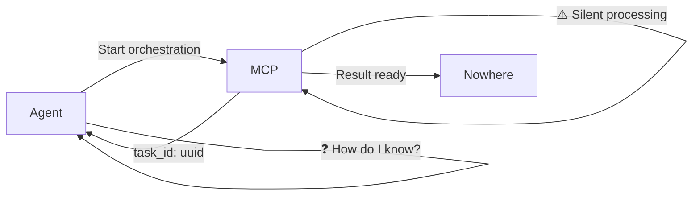

# Architectural Boundary Analysis: The Integration vs Service Boundary Problem

## 🎯 **The Core Discovery**

You've uncovered a **fundamental architectural category error**: We built a **Service Boundary** when we needed an **Integration Boundary**. This explains why the system "works but doesn't work" - it's solving the wrong boundary problem.

## 🔍 **The Six Instance Pattern Analysis**

### **Instance 4: The Temporal Disconnect**
```
Agent operates in "session time" (ephemeral)
MCP operates in "persistent time" (cross-session)
Gap: No temporal bridge for ongoing work
```

**Deep Analysis**: This is a **temporal impedance mismatch**. The agent expects:
- Immediate, session-scoped results
- Completion within its execution context
- Memory that exists only during its run

The MCP provides:
- Persistent, cross-session state
- Long-running background processes
- Memory that outlives any single session

**Real-World Analogy**: Like a waiter (agent) taking an order for a complex meal that requires hours to prepare (MCP orchestration). The waiter's shift ends, but the kitchen keeps cooking.

### **Instance 5: The Context Ownership Problem**
```
Agent: "I invoked this, results should be mine"
MCP: "I executed this, results live in my domain"  
Gap: No clear ownership handoff protocol
```

**Deep Analysis**: This is a **sovereignty conflict**. Two systems with different ownership models:

**Agent Sovereignty Model**:
```python
# Agent expects this pattern:
result = mcp_tool.orchestrate(query)
# Result "belongs" to agent's execution context
agent.use_result(result)  # Direct ownership
```

**MCP Sovereignty Model**:
```python
# MCP operates with this pattern:
task_id = mcp.start_orchestration(query)
# Result "belongs" to MCP's persistent state
result = mcp.get_result(task_id)  # Indirect access
```

### **Instance 6: The Feedback Loop Termination**
```
Agent → MCP: Clear signal
MCP → Agent: Silent success
Gap: No completion acknowledgment with actionable context
```

**Deep Analysis**: This is the **"delivery confirmation vs receipt confirmation"** problem:



The agent gets a **delivery confirmation** but never a **receipt confirmation**.

## 🪞 **The Mirror Pattern: "Delivered but Not Received"**

This pattern appears everywhere in distributed systems:

### **Email Analogy**
- **Sent**: Email leaves your outbox ✅
- **Delivered**: Reaches recipient's server ✅  
- **Read**: Recipient actually processes it ❓
- **Acted Upon**: Recipient takes action ❓

### **Package Delivery Analogy**
- **Shipped**: Package leaves warehouse ✅
- **Delivered**: Package at doorstep ✅
- **Received**: Recipient takes possession ❓
- **Utilized**: Recipient uses contents ❓

### **Our MCP Pattern**
- **Invoked**: MCP tool called ✅
- **Accepted**: Task queued ✅
- **Completed**: Orchestration finished ❓
- **Integrated**: Results available to agent ❓

## 🏗️ **Service Boundary vs Integration Boundary**

### **What We Built: Service Boundary**
```
┌─────────────────┐    ┌─────────────────┐
│     Agent       │    │      MCP        │
│                 │    │                 │
│ • Ephemeral     │    │ • Persistent    │
│ • Session-scoped│◄──►│ • Cross-session │
│ • Request/Reply │    │ • Async         │
│ • Stateless     │    │ • Stateful      │
└─────────────────┘    └─────────────────┘
     Clear separation, different lifecycles
```

**Characteristics**:
- Clean separation of concerns
- Different temporal models
- Async communication
- Independent failure domains
- Protocol-mediated interaction

### **What We Need: Integration Boundary**
```
┌─────────────────────────────────────────┐
│         Unified Workspace               │
│                                         │
│  ┌──────────┐    ┌──────────────────┐  │
│  │  Agent   │◄──►│  MCP Controller  │  │
│  │          │    │                  │  │
│  │ • Session│    │ • Cross-session  │  │
│  │ • Active │    │ • Persistent     │  │
│  └──────────┘    └──────────────────┘  │
│                                         │
│     Shared context, coordinated time    │
└─────────────────────────────────────────┘
```

**Characteristics**:
- Shared context space
- Coordinated temporal models
- Bidirectional state synchronization
- Unified failure handling
- Context-aware communication

## 🎛️ **The Three Boundary Options**

### **Option A: Enhanced Service Boundary**
Keep separation, add notification layer

```python
class NotificationBridge:
    """Bridges the temporal disconnect"""
    
    async def agent_notify_on_completion(self, task_id: str, agent_callback):
        """Agent registers for completion notification"""
        
    async def mcp_notify_completion(self, task_id: str, result):
        """MCP signals completion to waiting agents"""
```

**Pros**: 
- Maintains clean separation
- Scalable notification system
- Multiple agents can subscribe

**Cons**:
- Still has temporal mismatch
- Complex callback management
- Agent may not be alive to receive notification

### **Option B: Collapsed Integration Boundary**
Shared workspace, unified lifecycle

```python
class SharedWorkspace:
    """Unified agent-MCP execution context"""
    
    def __init__(self):
        self.active_agents = {}
        self.persistent_state = {}
        self.shared_context = {}
    
    async def integrated_orchestration(self, agent_id: str, query: str):
        """Agent and MCP share execution context"""
        agent = self.active_agents[agent_id]
        
        # Agent awareness of MCP progress
        async for progress in self.mcp_orchestrate(query):
            await agent.receive_progress(progress)
        
        # Immediate handoff when complete
        result = await self.get_orchestration_result()
        return await agent.integrate_result(result)
```

**Pros**:
- No temporal disconnect
- Clear ownership handoff
- Immediate feedback loops

**Cons**:
- Tight coupling
- Complex state management
- Harder to scale independently

### **Option C: Hybrid - Persistent Control Plane with Ephemeral Handoffs**
Best of both worlds approach

```python
class HybridBoundary:
    """Persistent control plane + ephemeral execution context"""
    
    def __init__(self):
        self.control_plane = PersistentMCPController()
        self.execution_contexts = {}
    
    async def create_agent_context(self, agent_id: str) -> AgentExecutionContext:
        """Create ephemeral context linked to persistent control plane"""
        context = AgentExecutionContext(
            agent_id=agent_id,
            control_plane=self.control_plane,
            temporal_bridge=TemporalBridge()
        )
        
        # Agent gets immediate access to orchestration
        context.orchestration_proxy = self.control_plane.create_proxy(agent_id)
        return context
    
    async def orchestrate_with_handoff(self, context: AgentExecutionContext, query: str):
        """Orchestration with guaranteed handoff"""
        
        # Start persistent orchestration
        task_id = await self.control_plane.start_orchestration(query)
        
        # Create ephemeral bridge for this agent
        bridge = await context.temporal_bridge.connect(task_id)
        
        # Agent gets live updates
        async for update in bridge.stream_progress():
            await context.agent.receive_update(update)
        
        # Guaranteed handoff when complete
        result = await bridge.wait_for_completion()
        return await context.agent.receive_final_result(result)
```

**Pros**:
- Persistent orchestration capability
- Ephemeral agent satisfaction
- Clear ownership handoff
- Temporal bridge solves disconnect

**Cons**:
- More complex implementation
- Additional abstraction layer
- Need to manage bridge lifecycle

## 🔬 **Deeper Pattern Analysis**

### **The "Impedance Mismatch" Meta-Pattern**

This is actually a specific instance of the **Impedance Mismatch** pattern from software architecture:

```
Different systems with incompatible abstractions trying to communicate
```

**Examples**:
- **Object-Relational Impedance**: Objects ↔ Tables
- **Sync-Async Impedance**: Blocking ↔ Non-blocking  
- **Temporal Impedance**: Session ↔ Persistent
- **Ownership Impedance**: Direct ↔ Indirect

### **The "Boundary Category Error"**

We made a **category error** in boundary selection:

```
Problem: "How do we make agent orchestration available via MCP?"

Wrong Category: Service Integration
"How do we expose orchestration as a service?"
→ Built service boundary
→ Clean separation, async communication

Right Category: Capability Integration  
"How do we give agents orchestration capability?"
→ Should build integration boundary
→ Shared context, coordinated execution
```

## 💡 **Architectural Recommendations**

### **For Your Specific Use Case: Option C (Hybrid)**

Given your multi-agent orchestration system, **Option C** best solves your boundary problem:

```python
class GrokHeavyIntegrationBoundary:
    """Hybrid boundary optimized for multi-agent orchestration"""
    
    def __init__(self):
        # Persistent orchestration engine
        self.orchestration_engine = PersistentOrchestrator()
        
        # Ephemeral agent contexts
        self.agent_contexts = {}
        
        # Temporal bridges
        self.bridges = TemporalBridgeManager()
    
    async def agent_request_orchestration(self, agent_id: str, query: str):
        """Agent requests orchestration with integrated handoff"""
        
        # Create or get agent context
        context = await self.get_or_create_agent_context(agent_id)
        
        # Start orchestration with bridge
        orchestration_id = await self.orchestration_engine.start(query)
        bridge = await self.bridges.create_bridge(agent_id, orchestration_id)
        
        # Return integrated orchestration proxy
        return IntegratedOrchestrationProxy(
            context=context,
            bridge=bridge,
            orchestration_id=orchestration_id
        )
    
    async def agent_await_result(self, proxy: IntegratedOrchestrationProxy):
        """Agent awaits result with temporal bridge"""
        
        # Live progress streaming
        async for progress in proxy.bridge.stream_progress():
            await proxy.context.agent.notify_progress(progress)
        
        # Guaranteed handoff
        final_result = await proxy.bridge.wait_for_completion()
        
        # Clean ownership transfer
        return await proxy.context.take_ownership(final_result)
```

### **Implementation Pattern: The "Temporal Bridge"**

The key insight is creating a **Temporal Bridge** that translates between different time models:

```python
class TemporalBridge:
    """Bridges session time ↔ persistent time"""
    
    def __init__(self, session_id: str, persistent_task_id: str):
        self.session_id = session_id
        self.persistent_task_id = persistent_task_id
        self.session_alive = True
    
    async def stream_progress(self):
        """Convert persistent progress to session events"""
        while self.session_alive:
            persistent_state = await self.get_persistent_state()
            session_event = self.translate_to_session_event(persistent_state)
            yield session_event
            
            if persistent_state.status == "COMPLETED":
                break
    
    async def wait_for_completion(self):
        """Session-blocking wait on persistent completion"""
        return await self.translate_persistent_result_to_session_result()
```

## 🎯 **Action Plan for Boundary Redesign**

### **Phase 1: Identify Current Boundary Type**
1. Map all current agent ↔ MCP interaction points
2. Classify each as Service vs Integration pattern
3. Identify specific impedance mismatches

### **Phase 2: Design Hybrid Boundary**
1. Design persistent control plane interface
2. Design ephemeral execution context system
3. Design temporal bridge architecture
4. Define ownership handoff protocols

### **Phase 3: Implement Incremental Migration**
1. Build temporal bridge system
2. Create agent execution contexts
3. Migrate one interaction at a time
4. Validate boundary behavior

## 🏆 **The Meta-Insight**

Your discovery reveals a **fundamental principle of distributed system architecture**:

> **Boundary Category Errors** are more damaging than implementation bugs because they create systems that work correctly but solve the wrong problem.

This is why your system "works at its core but these are what testing revealed" - the core logic is sound, but the **boundary abstraction is misaligned** with the actual use case.

The solution isn't to fix the service boundary, but to **recognize that you need an integration boundary** and redesign accordingly.

**Bottom Line**: You've identified that the real architectural challenge isn't making MCP work better as a service, but **making agent orchestration work as an integrated capability**. This requires a fundamentally different boundary design.